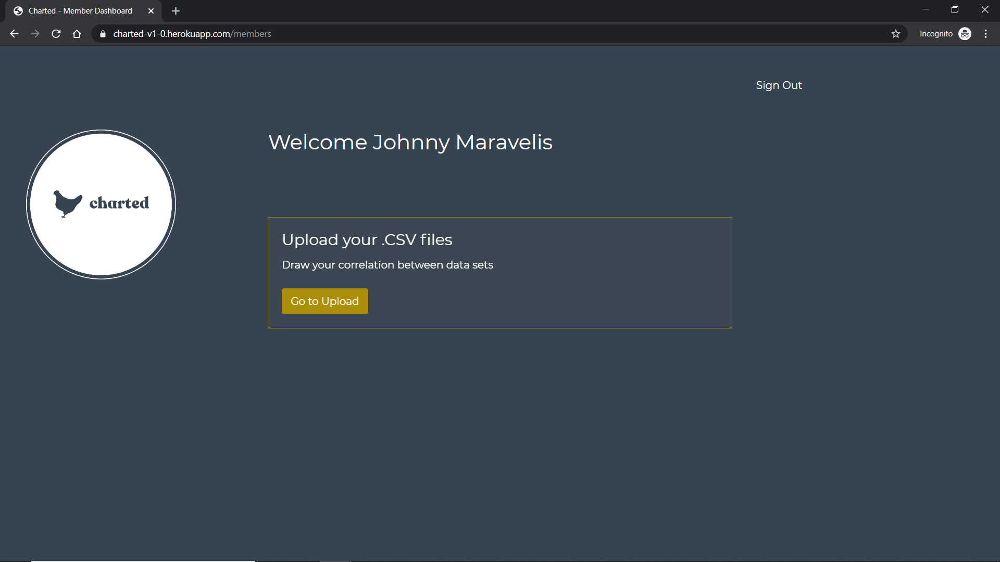

# Charted

Charted is an app geared for farmers and ranchers struggling to decipher their livestock and / or crop performance.  With Charted, a farmer / rancher can upload a .CSV file for on-demand field management.

### Prerequisites

You simply need to create an account through Charted by adding your full name, email, and password.

## Getting Started

Visit the deployed Charted link on Heroku at:
https://charted-v1-0.herokuapp.com/ 

Follow the on-screen instructions and SIGN UP (or LOG IN if an account was already created.)

Once in, upload a .CSV file and then click to display your chart.

NOTE:  Since this app has User Authentication and Validation through PassportJS, the User can save their chart(s) since it is securely held within our MySQL database.

## Future Developments
We plan on adding more features including, but not limiting to, manual User entry.

## Deployment

[Deployed link](https://charted-v1-0.herokuapp.com/)

## Built With

* [Git](https://git-scm.com/) - The terminal / bash framework used
* [JavaScript](https://www.javascript.com/) - Main programming / coding language
* [PassportJS](http://www.passportjs.org/) - User authentication / validation
* [ChartJS](https://www.chartjs.org/) - JavaScript for displaying dynamic charts
* [SQL / MySQL](https://www.mysql.com/) - Database language used for app
* [Sequelize](https://sequelize.org/) - A promise-based ORM for Node.js
* [NodeJS](https://nodejs.org/en/) - An open-source, cross-platform, environment that executes JavaScript code outside of a browser
* [ExpressJS](https://expressjs.com/) - Unopinionated, minimalist web framework for Node.js
* [Heroku](https://www.heroku.com/) - A cloud platform as a service supporting several programming languages; used for deployement

## Dependencies

* [bcryptjs](https://www.npmjs.com/package/bcryptjs) - Encryption
* [dotenv](https://www.npmjs.com/package/dotenv) - A zero-dependency module that loads environment variables from a .env file into process.env
* [dotenv-json](https://www.npmjs.com/package/dotenv-json) - Defines environment variables in .env.json in the root of your project
* [express](https://www.npmjs.com/package/express) - Express Server
* [express-session](https://www.npmjs.com/package/express-session) - Express middleware
* [multer](https://www.npmjs.com/package/multer) - Middleware for handling multipart / form-data, which is primarily used for uploading files
* [mysql2](https://www.npmjs.com/package/mysql2) - Increases database performance
* [passport](https://www.npmjs.com/package/passport) - Authentication
* [passport-local](https://www.npmjs.com/package/passport-local) - Local authentication
* [sequelize](https://www.npmjs.com/package/sequelize) - Used for Database

## Authors / Collaborators

FRONT END
* **Aly Shields** - *Project 2 for UNH Bootcamp* - [Aly Shields on GitHub](#)
* **Maria Shady** - *Project 2 for UNH Bootcamp* - [Maria Shady on GitHub](https://github.com/mariashady)

BACK END
* **Ibrahim Yunus** - *Project 2 for UNH Bootcamp* - [Yunusib12 on GitHub](https://github.com/Yunusib12)
* **Johnny Maravelis** - *Project 2 for UNH Bootcamp* - [PhoenixAfterglow on GitHub](https://github.com/PhoenixAfterglow)
* **Jason McGowan** - *Project 2 for UNH Bootcamp* - [Jasonmcgowan14 on GitHub](https://github.com/Jasonmcgowan14)

## Acknowledgments

* Thank you to UNH Bootcamp instructor (Scott Byers) / TAs (Michael Fearnley, Bobby Hoffman) for clearing things up when I hit my head against many walls.  Also a special thank you to fellow classmate Markus Markowich for sharing some insight and knowledge in the field of Biological Science, particularly with Agriculture.